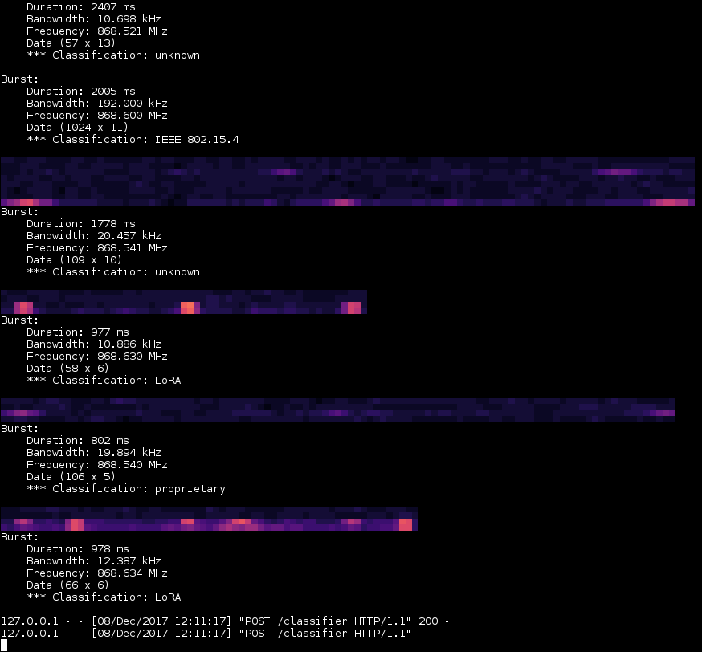
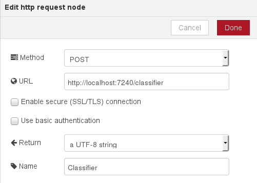

# Demo interference classifier

This package contains simple interference classifier for demonstration
purposes. It is intended to serve as an example for integrating more
sophisticated classifiers into Node-RED flows in combination with burst
tagging (`node-red-burst-tagging`).

The classifier uses a simple hand-written decision tree to classify bursts into
IEEE 802.15.4 packets, LoRA and SIGFOX transmissions.

## How to install

This package depends on the `node-red-python` package. You should make sure it
is installed before proceeding. See the `README.md` file in the corresponding
directory for instructions.

To install the classifier, run the following in the directory containing
`setup.py`:

    $ pip install -U .

## How to use

Run the classifier from a terminal window:

    $ demo-classifier

In Node-RED, drag a *http request* node from the toolbox into your flow.
Double-click the node and set the following settings:

Typically, you would then route the output of the *btagger* block into the
classifier. Output of the classifier is compatible with the *bdisplay* block.
The classifier adds a `text` property to each burst. Bursts that were not been
classified are dropped and are hence not shown on the display.

See documentation for the `node-red-burst-tagging` package for details.

## Author and license

Real-time visualization block for Node-RED flows was written by Tomaž Šolc,
**tomaz.solc@ijs.si**.

Copyright (C) 2017 SensorLab, Jožef Stefan Institute http://sensorlab.ijs.si

Javascript code was adopted from the Node-RED distribution, which is Copyright
2013, 2016 IBM Corp.

The research leading to these results has received funding from the European
Horizon 2020 Programme project eWINE under grant agreement No. 688116.

This program is free software: you can redistribute it and/or modify it under
the terms of the GNU General Public License as published by the Free Software
Foundation, either version 3 of the License, or (at your option) any later
version.

This program is distributed in the hope that it will be useful, but WITHOUT ANY
WARRANTY; without even the implied warranty of MERCHANTABILITY or FITNESS FOR A
PARTICULAR PURPOSE.  See the GNU General Public License for more details.

You should have received a copy of the GNU General Public License along with
this program. If not, see http://www.gnu.org/licenses
