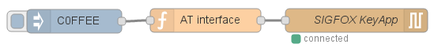

# Node-RED flow for controlling the SIGFOX KeyApp device

KeyApp is a hand-held device used for testing the SIGFOX network. It can be
controlled manually or using a computer over a USB connection. The USB
interface uses a serial emulation and a modem-like AT command protocol.

This package contains an example Node-RED flow that can be used to send packets
into the SIGFOX network using a KeyApp device.

## How to install

Copy the `keyapp` file to `~/.node-red/lib/flows`. For example:

    $ cd flow-keyapp
    $ cp keyapp ~/.node-red/lib/flows

After copying the file, you should restart Node-RED.

## How to use

Verify that the KeyApp device is turned on and connected to the computer
running Node-RED using a USB cable.

In the node-RED editor, go to the hamburger menu (upper right corner), select
*Import*, *Library*, *keyapp*. Drag the collection of nodes into an existing
flow.

In some cases (depending what other devices are connected to the computer) it
is necessary to adjust the path to the device. This can be done in the *SIGFOX
KeyApp* node settings. For example, `/dev/ttyUSB1` or `/dev/ttyUSB2` can be
used.

In the flow, the inject node (blue) creates a string (`C0FFEE`) that is then
sent as a payload over the SIGFOX network using the KeyApp device. You can
adapt the injected message as necessary or even replace the inject node with
some other function.

## See also

 *  SIGFOX KeyApp User Guide.

## Author and license

Node-RED flow for controlling the SIGFOX KeyApp device was written by Tomaž
Šolc, **tomaz.solc@ijs.si**.

Copyright (C) 2017 SensorLab, Jožef Stefan Institute http://sensorlab.ijs.si

The research leading to these results has received funding from the European
Horizon 2020 Programme project eWINE under grant agreement No. 688116.

This program is free software: you can redistribute it and/or modify it under
the terms of the GNU General Public License as published by the Free Software
Foundation, either version 3 of the License, or (at your option) any later
version.

This program is distributed in the hope that it will be useful, but WITHOUT ANY
WARRANTY; without even the implied warranty of MERCHANTABILITY or FITNESS FOR A
PARTICULAR PURPOSE.  See the GNU General Public License for more details.

You should have received a copy of the GNU General Public License along with
this program. If not, see http://www.gnu.org/licenses
