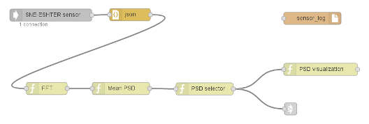
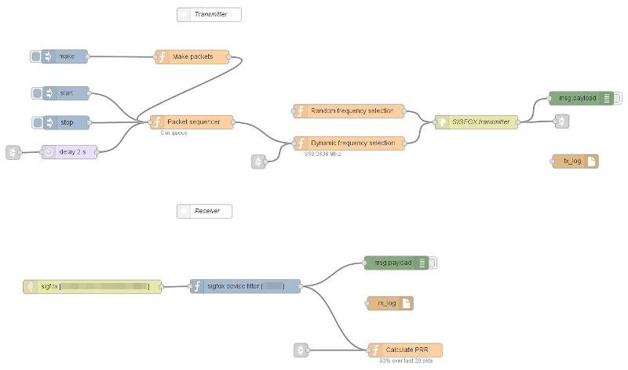

# Node-RED flow for measuring packet loss in a SIGFOX network

Low-Power Wide Area Networks (LP-WANs) are emerging as a promising solution for
connecting Internet of Things and Machine Type Communication devices. If
ultra-narrowband networks, a subclass of LP-WANs, reach predicted deployment
numbers and densities, they will face increasing packet loss due to inter- and
intra-technology interference.

The Node-RED flows in this package allow measurements of packet loss in the
SIGFOX network and experimentation with various frequency and transmit power
selection algorithms.

## How to install

Copy the `sigfox-packet-loss` and `sigfox-sensing` file tos
`~/.node-red/lib/flows`. For example:

    $ cd flow-packet-loss
    $ cp sigfox-* ~/.node-red/lib/flows

After copying the file, you should restart Node-RED and refresh the visual
editor in the browser.

Note that using this flow requires that other components of the SIGFOX toolbox
have been properly installed.

## How to use

In the node-RED editor, go to the hamburger menu (upper right corner), select
*Import*, *Library*, *sigfox-packet-loss*. Drag the collection of nodes into an
existing flow.

Repeat the procedure for the *sigfox-sensing* flow.

### Sensing flow

The sensing flow uses blocks from the `node-red-spectrum-sensing` and
`node-red-visualization` packages.

As currently implemented, the flow receives raw signal samples from the SIGFOX
uplink band from VESNA SNE-ESHTER spectrum sensor. It then calculates first
instantaneous power spectral density using a fast Fourier transform, and then
mean power spectral density over a time window.

Finally, a selector block uses the mean power spectral density estimate to
select a number of SIGFOX microchannels with the least amount of interference.

This process is also visualized in real-time using the visualization block from
the `node-red-visualization` package.

By connecting the output of the *SNE-ESHTER sensor* block to the `sensor_log`
block, the sensor data can be written to a file for later postprocessing.

### Packet loss measurement flow

The packet loss measurement flow implements a packet transmit-receive loop.

First, packets for transmission are generated in the *Make packets* block. The
block generates a number of packets with a sequence number in the packet
payload. Each packet can also have some metadata associated with it: frame
repetition count, a baseband and PGA gain. Setting the gains allows control
over the transmission power on a per-packet basis.

Packet generation can be triggered by clicking the *make* button.

Generated packets are queued in the *Packet sequencer* block. This block
sequences packet transmission, so that each packet will be transmitted after
the previous one with a certain delay. The delay can be configured through the
connected *delay* block.

Packet transmission can be started by clicking the *start* button. It can also
be cancelled, before all the queued packets have been transmitted, by clicking
the *stop* button.

The flow contains two example frequency selection blocks:

 *  *Random frequency selection* blindly assigns a random microchannel to a
    packet. This is similar to the existing SIGFOX protocol.

 *  *Dynamic frequency selection* takes into the account the selection of the
    least occupied microchannels received from the sensing flow. It randomly
    selects a microchannel from the list genered by the *PSD selector* block.

*SIGFOX transmitter* block sends the packet to the SIGFOX modem for actual
transmission over the air.

The transmitted packets are then received by a SIGFOX basestation. If a packet
is successfully received, the SIGFOX backend triggers a callback that is
received by the *sigfox [...]* block. The *device filter* block filters the
received callbacks by device ID and only outputs callbacks from the SIGFOX
transmitter used in the transmit part of the flow.

Finally, the *Calculate PRR* calculates and displays packet reception rate.

Outputs from the transmit and receive flow can also be connected to `tx_log`
and `rx_log` respectively to write packet data to files for later
postprocessing.

## See also

 *  [eWINE project deliverable D3.1](https://ewine-project.eu/deliverables/),
    section 2.4.4.
 *  [eWINE project deliverable D4.1](https://ewine-project.eu/deliverables/),
    section 3.2.
 *  T. Šolc, T. Gale, C. Fortuna: *Optimization of Ultra-Narrowband Wireless
Communication: an Experimental Case Study* (to be published).

## Author and license

Node-RED flow for measuring packet loss in a SIGFOX network was written by
Tomaž Šolc, **tomaz.solc@ijs.si**.

Copyright (C) 2017 SensorLab, Jožef Stefan Institute http://sensorlab.ijs.si

The research leading to these results has received funding from the European
Horizon 2020 Programme project eWINE under grant agreement No. 688116.

This program is free software: you can redistribute it and/or modify it under
the terms of the GNU General Public License as published by the Free Software
Foundation, either version 3 of the License, or (at your option) any later
version.

This program is distributed in the hope that it will be useful, but WITHOUT ANY
WARRANTY; without even the implied warranty of MERCHANTABILITY or FITNESS FOR A
PARTICULAR PURPOSE.  See the GNU General Public License for more details.

You should have received a copy of the GNU General Public License along with
this program. If not, see http://www.gnu.org/licenses
