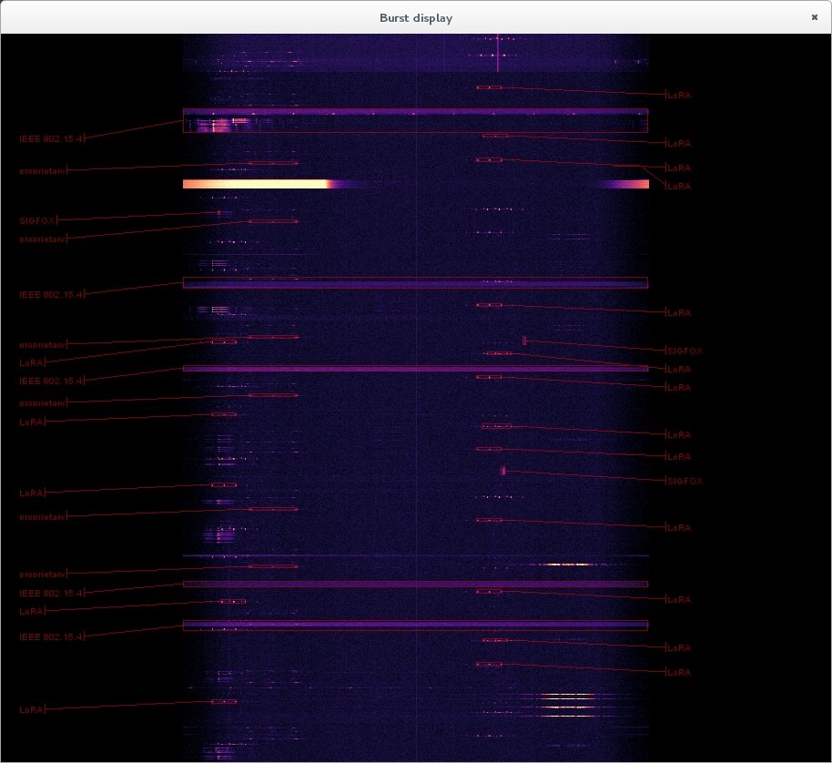
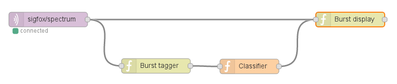

# Burst tagging blocks for Node-RED flows.

This package contains Node-RED blocks for real-time burst tagging in spectrum
sensing data (also called event detection). Bursts are short transmissions, usually
individual packets in packet-based wireless systems such a IEE 802.15.4, LoRA,
Sigfox, etc. A burst tagger detects such transmissions and records their
central frequency, bandwidth, start and stop times.

## How to install

This package depends on the `node-red-python` package. You should make sure it
is installed before proceeding. See the `README.md` file in the corresponding
directory for instructions.

To install burst tagging blocks, run the following in the directory containing
`setup.py`:

    $ pip install -U .

This command will install all required Javascript and Python components
automatically.

After installing, restart Node-RED and refresh the visual editor in the
browser. A *btagger* block should appear in the toolbox on the left under the
*sigfox* category.

## How to use

In the editor, drag the nodes from the toolbox onto a Node-RED flow. Typically,
a node providing the spectrum sensing stream (e.g. MQQT input block, *replay*
block or some other block providing a compatible JSON representation) is
connected to the input of the *btagger* block. Output of the *btagger* can be
routed directly to the *bdisplay* block, or optionally via some classification
block. *bdisplay* block can also be directly connected to the spectrum sensing
stream, which will cause it to show the waterfall diagram in the background of
the detected bursts.

Nodes in this package require back-end Python processes to be running in order
to function.  Otherwise a "Connection refused" error will be shown in Node-RED.
Each back-end process must be started manually, e.g. from a separate terminal
window. The command line for starting the back-end processes is shown in the
*info* box. For example:

    $ sfnr btagger

Note that `sfnr bdisplay` opens a separate window on the desktop. Visualization
cannot be shown with-in the browser.

## Author and license

Real-time visualization block for Node-RED flows was written by Tomaž Šolc,
**tomaz.solc@ijs.si**.

Copyright (C) 2017 SensorLab, Jožef Stefan Institute http://sensorlab.ijs.si

Javascript code was adopted from the Node-RED distribution, which is Copyright
2013, 2016 IBM Corp.

The research leading to these results has received funding from the European
Horizon 2020 Programme project eWINE under grant agreement No. 688116.

This program is free software: you can redistribute it and/or modify it under
the terms of the GNU General Public License as published by the Free Software
Foundation, either version 3 of the License, or (at your option) any later
version.

This program is distributed in the hope that it will be useful, but WITHOUT ANY
WARRANTY; without even the implied warranty of MERCHANTABILITY or FITNESS FOR A
PARTICULAR PURPOSE.  See the GNU General Public License for more details.

You should have received a copy of the GNU General Public License along with
this program. If not, see http://www.gnu.org/licenses
