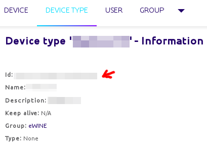
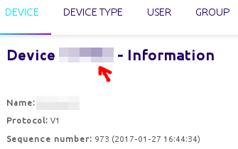
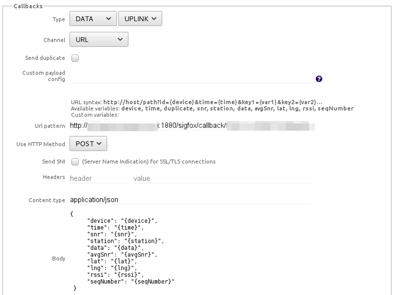

# Node-RED blocks for communicating with the SIGFOX backend API

This repository contains Node-RED blocks for communicating with the SIGFOX
backend API. SIGFOX backend is a web service for managing information about
devices present in the SIGFOX network and accessing packet data sent over the
network.

## How to install

Copy the contents of the `sigfox-in` and `sigfox-device-filter` directories
into one of the directories where Node-RED searches for nodes. For example
(assuming Node-RED has been installed under `~/node_modules`):

    $ cd node-red-sigfox-web-api
    $ mkdir ~/node_modules/node-red/nodes/sigfox
    $ cp -a sigfox-* ~/node_modules/node-red/nodes/sigfox

After copying the files, you should restart Node-RED.

## How to use

After installation, two new nodes should appear under the *sigfox* category in
the Node-RED editor toolbox:

 *  `sigfox-in` - Accept callbacks from the SIGFOX backend API. For each
    received packet, this block emits a JSON object containing all information
    about the packet provided by the backend.

    In the node settings, set the *Device type ID* field to the ID shown on the
    *Device Type* tab of the SIGFOX backend interface.

    

 *  `sigfox-device-filter` - This block can be used to filter the received
    packet callbacks, as emitted by the `sigfox-in` node, by SIGFOX device ID.

    In node settings, set the *Device* field to the *Device Id*, as shown on the
    *Device* tab of the SIGFOX backend interface.

    

    This ID is sometimes also shown on the device itself (5 to 6 hexadecimal
    numbers).

Before the `sigfox-in` node will begin receiving callbacks, the appropriate
callback configuration has to be entered into the SIGFOX backend interface.
This configuration can be found under *Device Type - Callbacks* tab. The
computer running Node-RED must have a static, publicly accessible IP.

The screenshot below shows the correct configuration.

The *Url pattern* field must be of the following format:

    http://host:port/sigfox/callback/deviceTypeId

where *host* is the host running Node-RED with the `sigfox-in` block, *port* is
the port running the Node-RED editor (1880 by default) and *deviceTypeId* is
the Device type ID entered in the `sigfox-in` node settings.

## See also

 *  SIGFOX Callback API documentation
 *  [Node-RED: Creating Nodes](http://nodered.org/docs/creating-nodes/)

## Author and license

Node-RED blocks for communicating with the SIGFOX backend API were written by
Tadej Gale.

Copyright (C) 2017 SensorLab, Jožef Stefan Institute http://sensorlab.ijs.si

The research leading to these results has received funding from the European
Horizon 2020 Programme project eWINE under grant agreement No. 688116.

This program is free software: you can redistribute it and/or modify it under
the terms of the GNU General Public License as published by the Free Software
Foundation, either version 3 of the License, or (at your option) any later
version.

This program is distributed in the hope that it will be useful, but WITHOUT ANY
WARRANTY; without even the implied warranty of MERCHANTABILITY or FITNESS FOR A
PARTICULAR PURPOSE.  See the GNU General Public License for more details.

You should have received a copy of the GNU General Public License along with
this program. If not, see http://www.gnu.org/licenses

