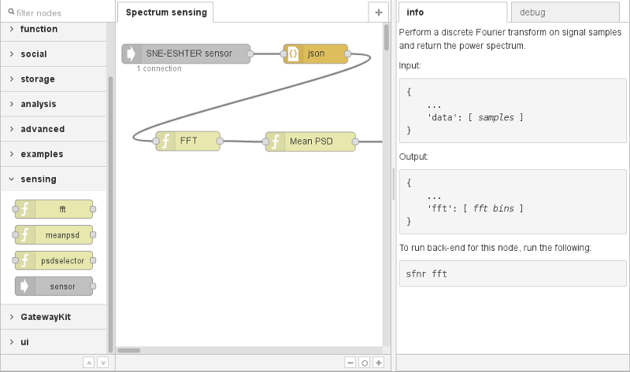

# Node-RED blocks for spectrum sensing

This package contains a number of spectrum sensing-related blocks for use with
Node-RED.

## How to install

This package depends on the `node-red-python` package. You should make sure it
is installed before proceeding. See the `README.md` file in its directory for
instructions.

Run the following in the directory containing `setup.py`:

    $ pip install -U .

This command will install all required Javascript and Python components
automatically.

After installing, restart Node-RED. A *sensing* category of nodes should appear
in the toolbox on the left, as shown in the screenshot above.

## How to use

In the editor, drag the node from the toolbox onto a Node-RED flow. Each node
has instructions for use that appear in the *info* box on the right after
you select it.

All nodes require a back-end Python process to be running in order to function.
Otherwise a "Connection refused" error will be shown in Node-RED. The back-end
process must be started manually, e.g. from a separate terminal window. The
command line for starting the back-end process is shown in the *info* box.

As a general rule, the nodes in this package take a *JSON* object as an input.
Each node expects certain fields to be present, as shown in the *info* box. The
node returns the same object on the output, with one or more fields added to it.

There are some hard-coded global settings affecting all nodes in the
`sfnr.config.sensing` module.

## See also

 *  [eWINE project deliverable D3.1](https://ewine-project.eu/deliverables/),
    section 2.4.3.
 *  [vesna-spectrum-sensor](https://github.com/avian2/vesna-spectrum-sensor)
    application.
 *  [hardware in the LOG-a-TEC testbed](http://log-a-tec.eu/cr-hardware.html).

## Author and license

Node-RED spectrum sensing blocks were written by Tomaž Šolc, **tomaz.solc@ijs.si**.

Copyright (C) 2017 SensorLab, Jožef Stefan Institute http://sensorlab.ijs.si

Javascript code was adopted from the Node-RED distribution, which is Copyright
2013, 2016 IBM Corp.

The research leading to these results has received funding from the European
Horizon 2020 Programme project eWINE under grant agreement No. 688116.

This program is free software: you can redistribute it and/or modify it under
the terms of the GNU General Public License as published by the Free Software
Foundation, either version 3 of the License, or (at your option) any later
version.

This program is distributed in the hope that it will be useful, but WITHOUT ANY
WARRANTY; without even the implied warranty of MERCHANTABILITY or FITNESS FOR A
PARTICULAR PURPOSE.  See the GNU General Public License for more details.

You should have received a copy of the GNU General Public License along with
this program. If not, see http://www.gnu.org/licenses
