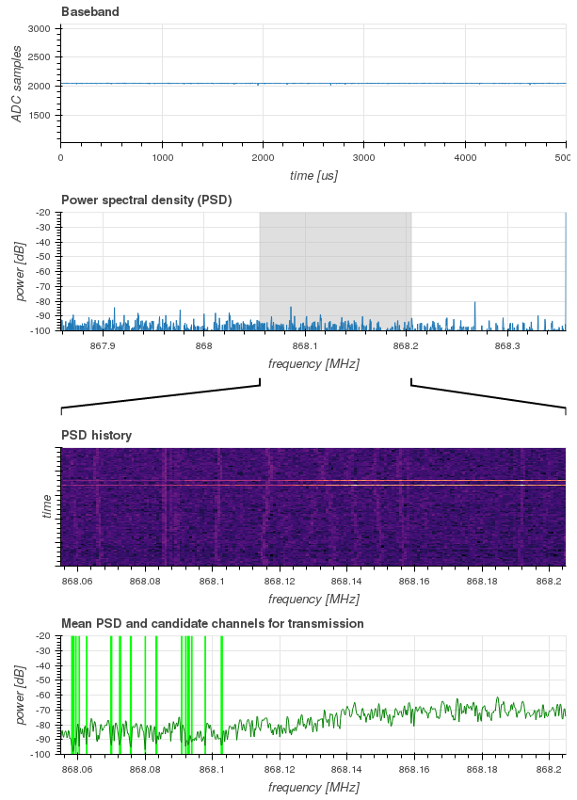

# Real-time visualization block for Node-RED flows.

This package contains Node-RED blocks for real-time visualizations of spectrum
sensing data and channel selection.

## How to install

This package depends on `node-red-python` and `node-red-spectrum-sensing`
packages. You should make sure they are installed before proceeding. See the
`README.md` file in corresponding directories for instructions.

To install the visualization block, run the following in the directory
containing `setup.py`:

    $ pip install -U .

This command will install all required Javascript and Python components
automatically.

After installing, restart Node-RED and refresh the visual editor in the
browser. A *psdvisual* block should appear in the toolbox on the
left under the *sensing* category.

## How to use

In the editor, drag the node from the toolbox onto a Node-RED flow. Connect the
input for the *psdvisual* block to outputs of any of the other blocks under the
*sensing* category to update the corresponding graphs.

The node requires a back-end Python process to be running in order to function.
Otherwise a "Connection refused" error will be shown in Node-RED. The back-end
process must be started manually, e.g. from a separate terminal window. The
command line for starting the back-end process is shown in the *info* box (this
command must be run from the `node-red-visualization` directory):

    $ bokeh serve nodes/psdvisual.py

After the back-end process has been started, the visualization can be seen in the browser at
http://localhost:5006/psdvisual

By default, only one user on the local system can see the visualization. It is
possible to allow access to other users as well. See [Bokeh
manual](http://bokeh.pydata.org/en/latest/docs/user_guide/cli.html#module-bokeh.command.subcommands.serve).

## Author and license

Real-time visualization block for Node-RED flows was written by Tomaž Šolc,
**tomaz.solc@ijs.si**.

Copyright (C) 2017 SensorLab, Jožef Stefan Institute http://sensorlab.ijs.si

Javascript code was adopted from the Node-RED distribution, which is Copyright
2013, 2016 IBM Corp.

The research leading to these results has received funding from the European
Horizon 2020 Programme project eWINE under grant agreement No. 688116.

This program is free software: you can redistribute it and/or modify it under
the terms of the GNU General Public License as published by the Free Software
Foundation, either version 3 of the License, or (at your option) any later
version.

This program is distributed in the hope that it will be useful, but WITHOUT ANY
WARRANTY; without even the implied warranty of MERCHANTABILITY or FITNESS FOR A
PARTICULAR PURPOSE.  See the GNU General Public License for more details.

You should have received a copy of the GNU General Public License along with
this program. If not, see http://www.gnu.org/licenses
