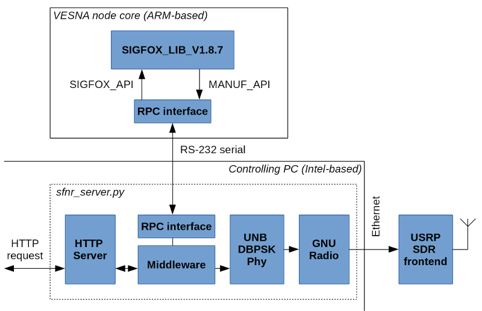

# RPC interface firmware for SIGFOX MAC on VESNA sensor node

SIGFOX network uses a proprietary MAC layer that is implemented in the form of
a binary library for the ARM Cortex-M3 architecture. In order to implement a
software SIGFOX modem on a Linux-running PC (Intel-architecture based), access
to this library is required.

This repository contains a firmware that wraps the MAC layer library in a
simple remote procedure call (RPC) interface that can be accessed over the
serial line. The firmware is designed to be uploaded to an ARM-based VESNA
node. It forms a part of the SIGFOX test device.

## How to compile and upload

Following instructions assume that a VESNA development environment has been
properly installed. See the [setup
manual](https://sensorlab.github.io/vesna-manual/documents/install-guide-linux.pdf),
section about the command-line toolchain.

To compile this firmware, a proprietary SFXLIB library is required. The
following files should be placed under the `sigfox/` directory:

    sigfox
    ├── include
    │   ├── manuf_api.h
    │   ├── sigfox_api.h
    │   └── sigfox_types.h
    └── lib
        └── libIJS_SIGFOX_LIB_V1.8.7.a

The firmware also needs a correct private key and device ID. These are defined
in the `sigfox.c` file and should be corrected according to documentation
provided by SIGFOX before compiling.

To compile the firmware, run:

    $ make

To upload the compiled firmware to a VESNA SNC, connect the board to an Olimex
ARM-USB-OCD programmer and run:

    $ make sigfox.u

## How to use

The firmware exposes a simple text-based RPC interface on the USART0 serial
line. Baud rate is 115200.

RPC interface can be used to instruct the MAC layer to send a packet and to
intercept the MAC layer's calls to the transceiver and NVRAM interfaces.

Note: the `sigfox-test-device` package contains the computer-side of the RPC
interface in form of a Python module.

## See also

 *  [eWINE project deliverable D3.1](https://ewine-project.eu/deliverables/),
    section 2.4.2.

## Author and license

RPC interface firmware for SIGFOX MAC on VESNA sensor node was written by Tomaž
Šolc, **tomaz.solc@ijs.si**.

Copyright (C) 2017 SensorLab, Jožef Stefan Institute http://sensorlab.ijs.si

Contains AES 128 implementation, which is Copyright (c) 2011, Texas Instruments
Incorporated

The research leading to these results has received funding from the European
Horizon 2020 Programme project eWINE under grant agreement No. 688116.

Do not redistribute.
